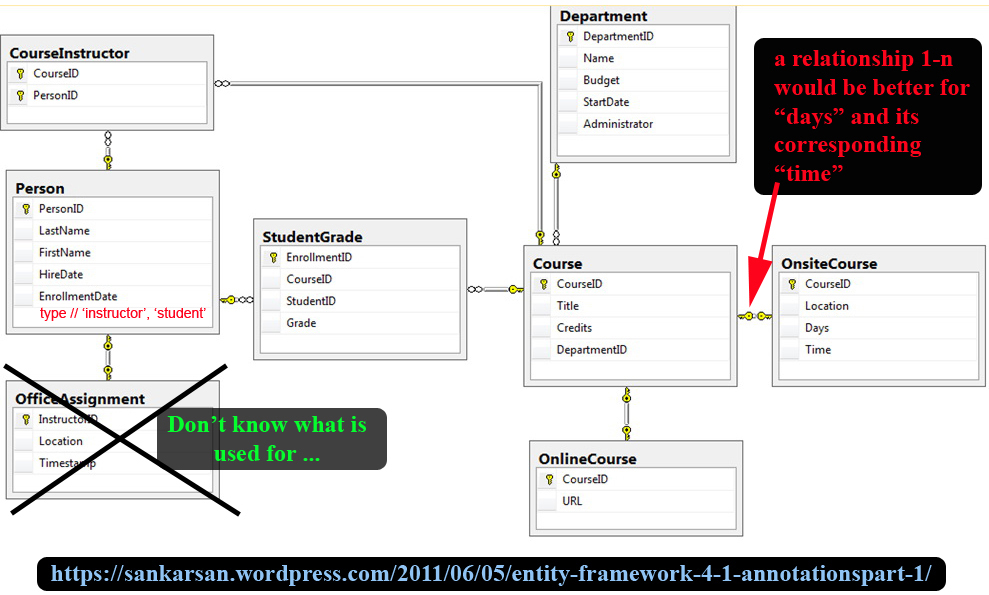

# Courses Organizer - ReactJS

---
# BUILDING: Backend: Done! Need 2 Add frontend ...

---

## Aim
Building a project based on an EER (Enhanced Entity-Relationship).

## Enhanced Entity-Relationship

## Requests (**C**reate, **R**ead, **U**pdate or **D**elete)
We could make **C**reate, **R**ead, **U**pdate or **D**elete with this database. All possibilities are listed [here](./assets/docs/requests.md).

## Configuration (VERY IMPORTANT)

At the project's root folder, we have a file name "##server.js##", by the end, we have:

It's very important to follow the instruction, otherwise, you could have very disappointed surprises ...

---------------

## Author
* Dinh HUYNH - All Rights Reserved!
* dinh.hu19@yahoo.com