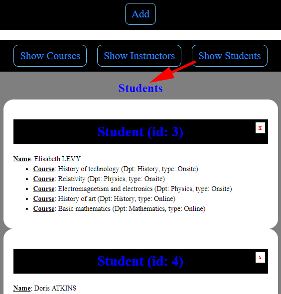
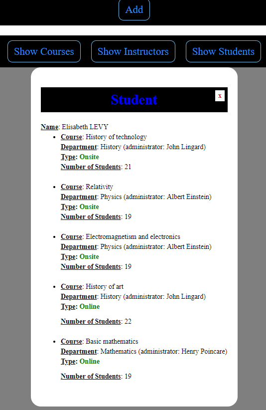
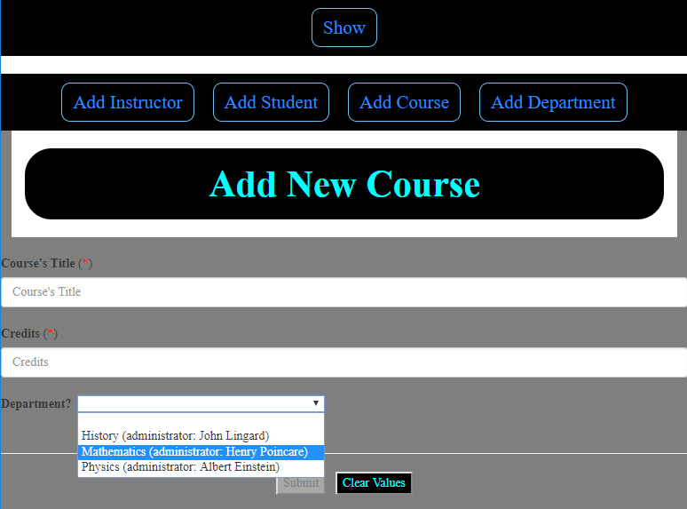
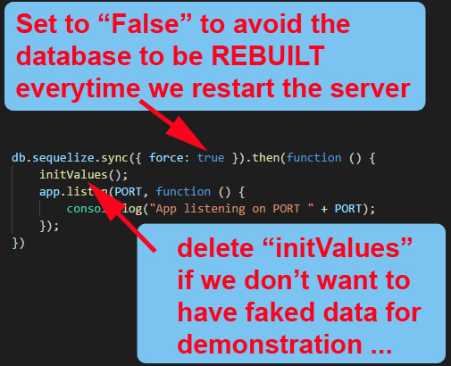

# Courses Organizer

# [Project will be upgraded: Authentication will be set up for SERVER, DATABASE and UI to protect every "route" that needs protection. The project will NOT WORKING until the process of separation will be done (because some files have been moved)!]

## Aim
Building a project based on an EER (Enhanced Entity-Relationship). The goal is to learn to build project base on someone's idea, which is much more difficult than with ours.

> This project is one of about 30-35 others building by mixing:
>   * Front-End: **jQuery**, **ReactJS**, **React-Redux**, **Angular** (2-5), **Ionic3**, **View.js**
>   * Back-End: 5 APIs (2 with **MongoDB** and 3 with **SQL**)
> 
> These are **3-tier Architecture** projects. Everything is started (almost) from scratch (the diagrams for the databases come from the Internet - with link to to source on each picture - with errors which were fixed)
>
> The **Front-End** are NOT the most beautiful because not much work on it. The goal is to use very different technologies on very different purposes.

> This application allows a school's department to manage its courses taking care of all relationship between: 
>  * **instructors**
>  * **students** (**grade**)
>  * **courses** (**online**, **onsite** with schedule, place and time)

---

## Technologies
> * **Security**: **JWT-simple**, **bcrypt-nodejs**, **passport** (**passport-jwt**, **passport-local**)
> * **Front End**: ***React-Redux***
> * **Back End**: ***Express/Node.js*** + ***Sequelize*** (ORM)
> * **Database**: ***mySQL***

---------------

## Enhanced Entity-Relationship

## Requests (**C**reate, **R**ead, **U**pdate or **D**elete)
We could make **C**reate, **R**ead, **U**pdate or **D**elete with this database. All possibilities are listed [here](./assets/docs/requests.md).

---

## User Interface
### List of Students

### All Information about a Student

### Add a Course

---

## Execution

> The project is build as a 3-tier architecture (fullstack), and the three parts was built to be ready to be put on different machines (which could be in different continents). So, we need to run 3 parts independently, in order: **database**, then **server** then **user interface**.
>
> 1 - You need to create your database with the name '**courses_organizer**' then start it with the tool you are using (LCI or MySQL Workbench, or...) and don't forget to enter some configuration's data (enter the password of **YOUR** database. Instruction in this file [here](https://github.com/DinhLeGaulois2/sql_react_redux_courses_organizer/blob/master/server/models/index.js))
>
> 2 - Open a terminal, and execute (in the folder "**server**"): **npm install** (to install **dependencies**)
> 
> 3 - Open ANOTHER termimal, and execute (in the folder "**client**"): **npm run build** (to run the **server**)
>
> 4 - Open your web browser (***Firefox***, ***Chrome***, etc.) then, enter: **localhost:3000**

---

## Configuration (VERY IMPORTANT)

At the project's root folder, we have a file name "**server.js**" ([here](https://github.com/DinhLeGaulois2/sql_react_redux_courses_organizer/blob/master/server.js)), by the end, we have:

It's very important to follow the instruction, otherwise, you could have very disappointed surprises ...

---------------

## Author
* Dinh HUYNH - All Rights Reserved!
* dinh.hu19@yahoo.com